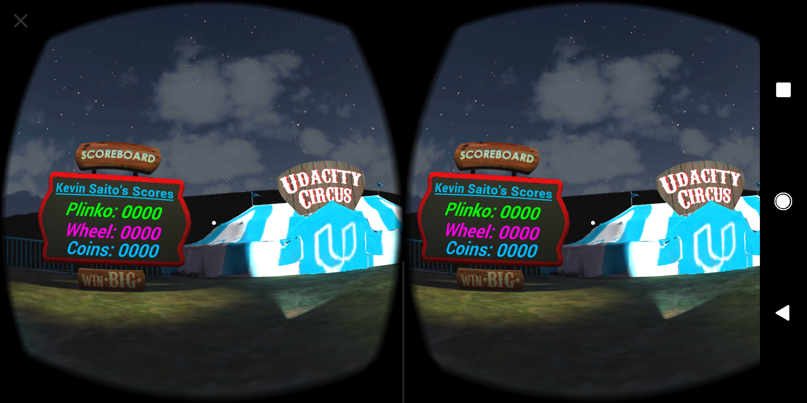

# Udacity Carnival
Project #1 for the Udacity [VR Developer Nanodegree](http://udacity.com/vr) program.

- Course: Introduction to Virtual Reality
- Project: Udacity Carnival

This project is built based on the starter project provided by Udacity. The goal of this project is to get familiar with Unity by custimizing the starter project, and to learn how to deploy the application to a smartphone. I created an apk file for an Android device. 

### Submitted by
Kevin Saito

### Versions Used
- [Unity LTS Release 2017.4.15](https://unity3d.com/unity/qa/lts-releases?version=2017.4)
- [GVR SDK for Unity v1.170.0](https://github.com/googlevr/gvr-unity-sdk/releases/tag/v1.170.0)
- [TextMesh Pro](https://assetstore.unity.com/packages/essentials/beta-projects/textmesh-pro-84126) v1.2.2

### Screenshot

